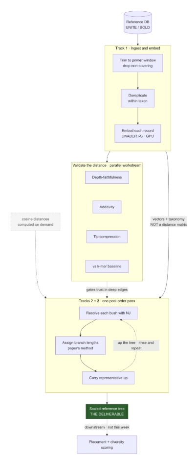

# Evospaice — a scaled reference tree from barcode embeddings

Evospaice builds a **reference tree with meaningful branch lengths** from a large
database of DNA barcodes, so biodiversity can be measured by genetic distance
rather than by counting species. It is the working repo for the Dublin
Microsoft hackathon.

**The one idea that makes this tractable:**

> The **taxonomy** gives the tree its rough shape. The **embeddings** resolve the
> shape within each group and scale every branch.

We do **not** infer a tree from scratch (that doesn't scale to millions of
records). We take the taxonomic backbone as given, use precomputed sequence
embeddings to resolve its bushy nodes and put lengths on the branches, and walk
the whole thing bottom-up so it stays tractable.

**Scope for the week is deliberately narrow:** one tree, one marker, one group —
the *Leray-313 COI tree for insects*, built from **BOLD**. Don't generalise
beyond that; the scope is a given, not something to discover.



---

## Start here

- **New to the project?** Read the [detailed written brief](docs/Hackathon%20brief.md)
  (the full explanation), then skim the [slides](https://docs.google.com/presentation/d/1tmwUtHtdYxmklvtVXBrXGwielnjqg3Fat19jX08IHeE/edit)
  or watch [Rutger's walk-through](https://drive.google.com/file/d/1zPuKvw2lG_GrZrBRYMykWRFMUIKNMRUW/view).
- **Need the diversity maths?** Victor's [distances explainer](docs/explain-distances.md)
  is the spec (and the test oracle) for Faith's PD and UniFrac.
- **Want to start coding?** Set up the [environment](#environment--setup), then
  find your [track](#the-tracks) and its open issues on the project board.

---

## Repository layout

```
evospaice/
├── src/               # all code — one subpackage per track (see below)
├── data/              # inputs and committed toy / subset fixtures (see data/README.md)
├── docs/              # brief, explainers, links to slides & video, prior art
├── images/            # figures
├── pyproject.toml     # dependencies (managed with uv)
└── .devcontainer/     # reproducible environment for Codespaces / VS Code
```

- **Code** lives in `src/`.
- **Data** lives in `data/` — a small committed subset for developing against,
  plus scripts/pointers for the full BOLD export. Never let the multi-GB
  download block you from writing code.

---

## The tracks

The pipeline splits into independent tracks that meet at clean interfaces, so
they can be worked in parallel. The load-bearing seam is a **swappable distance
function** — `embed(seq) -> vector` and `distance(a, b) -> float` — with an
embedding-backed implementation and a k-mer baseline, so Track 1, Tracks 2 & 3,
and the validation workstream never block each other.

| Track | What it does | Lives in | Done when… |
| --- | --- | --- | --- |
| **1 — Ingest & embed** | Trim records to the primer window, dereplicate *within taxon*, embed each record. Outputs vectors + taxonomy — **not** a distance matrix. | `src/ingest/` | Each retained record has a vector and a taxonomy label. |
| **2 & 3 — Resolve & scale** | One post-order walk of the backbone: at each node, resolve the bush with NJ on a small on-demand distance block, assign branch lengths (Wei & Koslicki's bottom-up method), carry one representative up. | `src/tree/` | A resolved, branch-length-scaled tree (Newick). |
| **Validate the distance** | Check that embedding distances are a faithful *metric*, not just a good *identifier*: depth-faithfulness, additivity, tip-compression — vs the k-mer baseline. | `src/validate/` | We know at which depths the embedding distances are trustworthy. |
| **4 — Visualisation** | Turn the tree into a compelling picture; research existing tools (e.g. iTOL) rather than building a viewer. | `src/viz/` | A legible rendering of the tree. |
| **5 — Applications** | Demonstrate utility: α/β phylogenetic diversity on sample data, and outlier detection for database curation. | `src/diversity/` | PD/UniFrac numbers for sample data + a curation example. |

Full detail, guardrails, and per-track "definition of done" are in the
[brief](docs/Hackathon%20brief.md).

---

## Non-negotiables (how to stay on the plan)

These are the architectural commitments the whole design rests on. If you're
doing any of the left-hand things, stop:

- ❌ Building a tree from scratch from the sequences → ✅ the **taxonomy** supplies the shape.
- ❌ Materialising a global all-pairs distance matrix → ✅ vectors out of Track 1; **distances computed on demand** inside the traversal.
- ❌ Solving one taxonomic level and stitching → ✅ a single **recursive, post-order** pass (this is the lesson from the prior COI attempt).
- ❌ Resolving deep nodes fully with NJ → ✅ **gate resolution**; leave saturated deep nodes as soft bushes.
- ❌ Feeding a giant polytomy straight into NJ → ✅ **pre-cluster into ~√k buckets** first.
- ❌ Trusting the embedding for scaling because it matched BLAST for ID → ✅ that certifies *retrieval*, not *metric quality*; the **validation** track is what licenses the scaling.

---

## Environment & setup

Dependencies are pinned with [**uv**](https://docs.astral.sh/uv/) via
`pyproject.toml` + `uv.lock`, so every machine converges on the same
environment.

```bash
# one-time
uv sync

# run anything in the environment
uv run python -m evospaice.<module>
uv run pytest            # the toy end-to-end smoke test should stay green
```

Or open the repo in **GitHub Codespaces** (or VS Code Dev Containers) and the
`.devcontainer/` config builds the environment for you — recommended so nobody
loses the first morning to a broken install.

**Core dependencies:** `numpy`, `scipy`, `biopython`, `scikit-bio` (Neighbor-
Joining), `dendropy` (tree I/O / Newick), `faiss-cpu` (nearest-neighbour lookups),
`sourmash` (the k-mer baseline). The embedding model and how it's served are
specified in [`data/README.md`](data/README.md).

---

## Prior art

- [barcode-constrained-phylogeny](https://github.com/naturalis/barcode-constrained-phylogeny) — a prior COI attempt. **Lesson:** you can't pick one taxonomic level, solve there, and stitch; it must be recursive.
- [MDDB-phylogeny](https://github.com/naturalis/MDDB-phylogeny) — a prior ITS attempt. **Lesson:** scalable, alignment-free, distance-based approaches are tractable, but need taxonomic guidance for quality.
- [branch-lengths-assignment](https://github.com/KoslickiLab/branch-lengths-assignment) — Wei & Koslicki, the [preprint](https://www.biorxiv.org/content/10.1101/2024.07.29.605688v2) whose bottom-up method we reuse for scaling.

---

## License & outputs

**All outputs of this project — the reference trees, branch lengths, embeddings,
and derived diversity numbers — are released into the public domain
([CC0 1.0](https://creativecommons.org/publicdomain/zero/1.0/)).** Use them for
anything, no attribution required.
