# Pipeline architecture

## Purpose

The EvoSpaice ingestion pipeline filters a source FASTA by taxonomic class,
embeds the retained records with Omni-DNA 20M, builds a global FAISS index, and
splits that index into independently usable species bundles.

## Data flow

```mermaid
flowchart LR
    Trigger[Trigger JSON blob] --> EG1[Event Grid]
    EG1 --> Q1[Service Bus: fasta-filter-trigger-events]
    Q1 --> F1[Class filter Function]
    Source[Source FASTA blob] --> F1
    F1 --> Filtered[filtered-sequences/class.fasta]

    Filtered --> EG2[Event Grid]
    EG2 --> Q2[Service Bus: fasta-embedding-trigger-events]
    Q2 --> F2[Embedding submitter Function]
    F2 --> A100[Azure ML dedicated A100 job]
    A100 --> Global[embedding-results/source/etag]
    Global --> Index[index.faiss]
    Global --> Metadata[records.parquet]
    Global --> Manifest[manifest.json]

    Index --> EG3[Event Grid]
    EG3 --> Q3[Service Bus: species-split-trigger-events]
    Q3 --> F3[Species split coordinator Function]
    F3 --> CPU[8 Azure ML CPU shard jobs]
    CPU --> Species[species-results/source/etag]
```



## Stages

### 1. Class filtering

A JSON file written to `pipeline-triggers` specifies `source_blob_url` and
`target_class`. Event Grid routes the BlobCreated event through Service Bus to
the class-filter Function. The Function streams the source FASTA and writes
`<target_class lowercase>.fasta` to `filtered-sequences`.

### 2. Omni-DNA embedding

Creation of a filtered `.fasta` blob triggers the embedding submitter. It creates
one deterministic Azure ML job on `gpu-NC24ADS-a100-dedicated`. AML downloads the
source through the `filteredsequences` datastore. The worker writes a global
FAISS/Parquet/JSON bundle to `embedding-results/<source>/<source-etag>/`.

`index.faiss` is published last, after `records.parquet` and `manifest.json`, so
downstream processing cannot observe an incomplete bundle.

### 3. Species splitting

Creation of `/index.faiss` triggers the species split coordinator. It submits
eight deterministic jobs to `cpu-species-split-dedicated`. A stable species hash
assigns every species, including `unknown`, to exactly one shard. All jobs write
globally unique filenames into one folder:

```text
species-results/<source>/<source-etag>/
```

Each species has matching `.faiss`, `.parquet`, and `.json` files.

## Shared services

- Azure Resource Group: Terraform-managed hack resource group.
- Azure Storage: ML storage holds filtered, embedding, and species outputs.
- Event Grid: one storage system topic with stage-specific subscriptions.
- Service Bus: one Standard namespace with one queue per event-driven stage.
- Azure Functions: Flex Consumption, Python 3.12, system-assigned identity.
- Azure ML: managed-identity workspace, A100 embedding compute, CPU splitting compute.
- Monitoring: shared Application Insights and Log Analytics workspace.

## Idempotency

- Class filtering overwrites the class-derived FASTA blob.
- Embedding job names and output paths include the filtered FASTA ETag.
- Species splitting job names include the `index.faiss` ETag.
- Shard output paths use the source bundle version and globally unique species keys.
