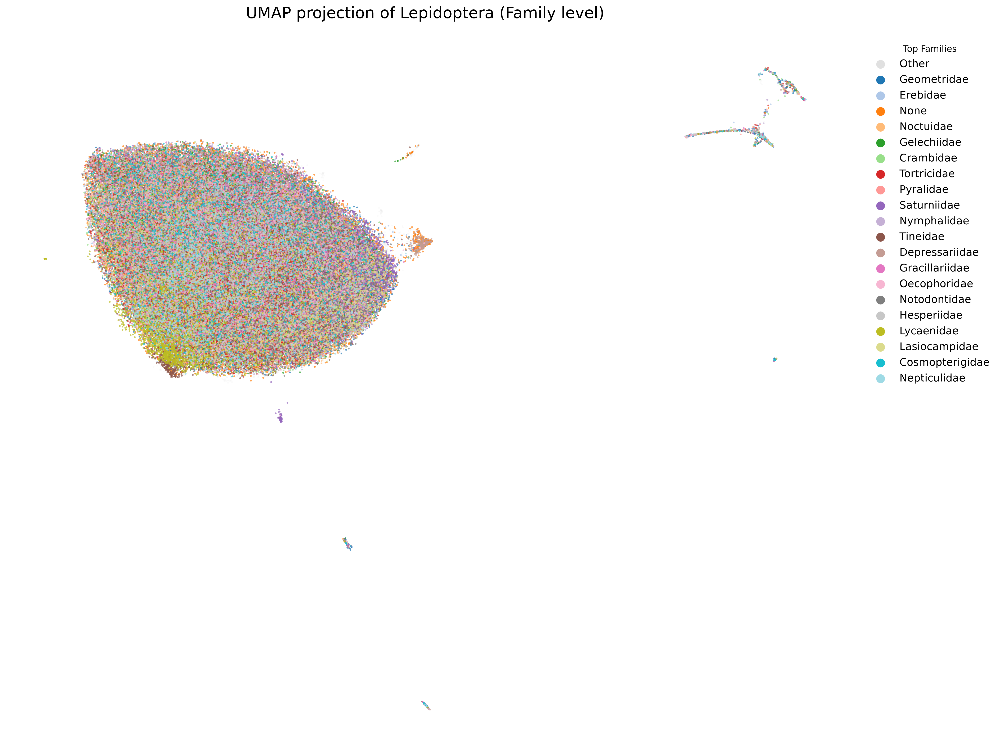
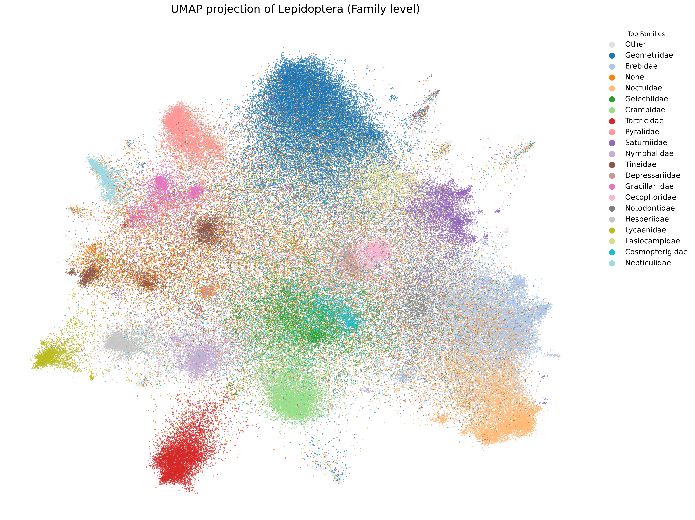
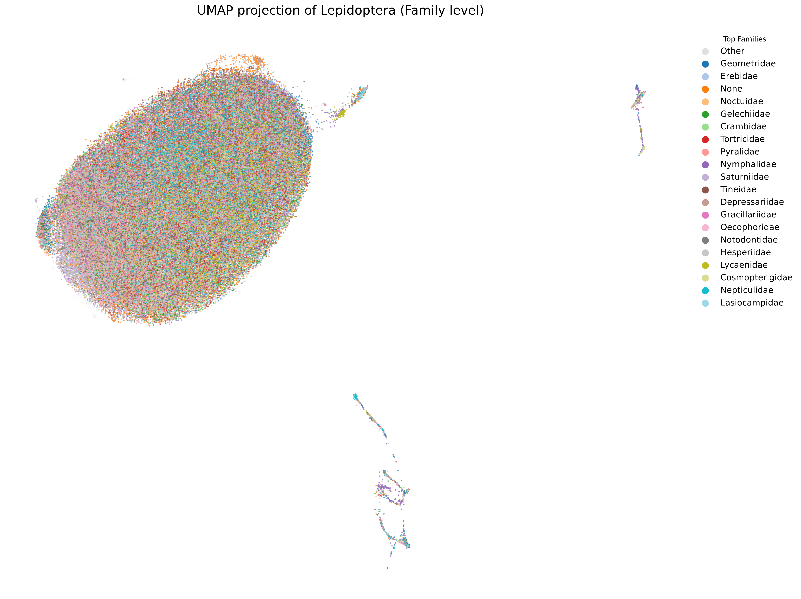
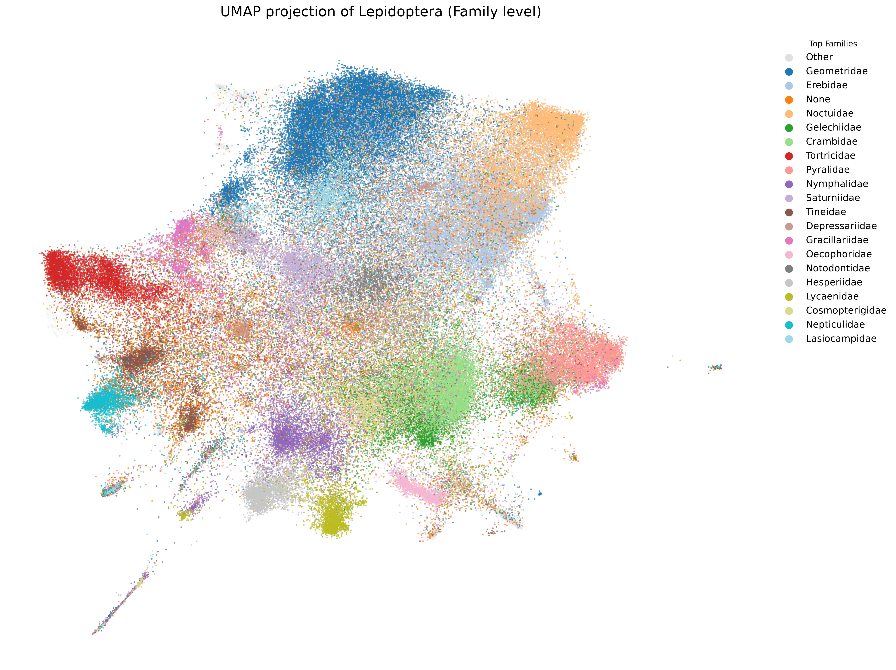
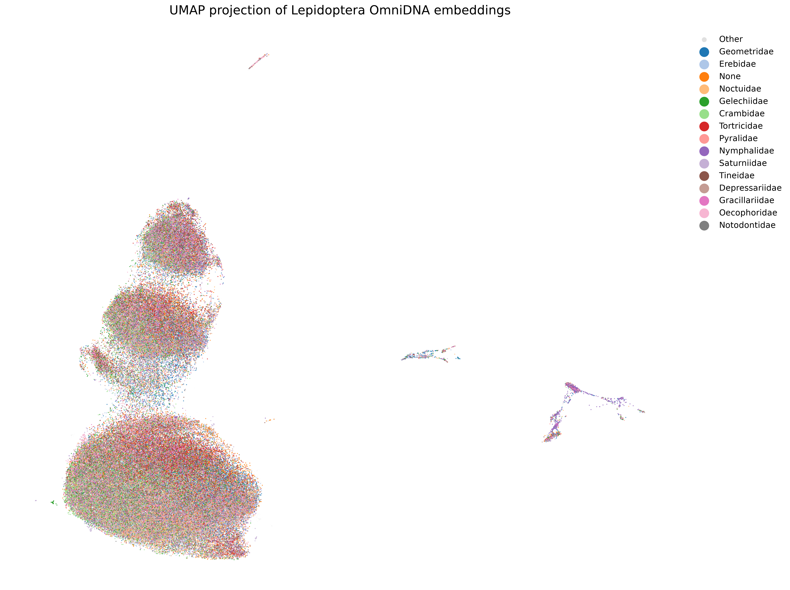
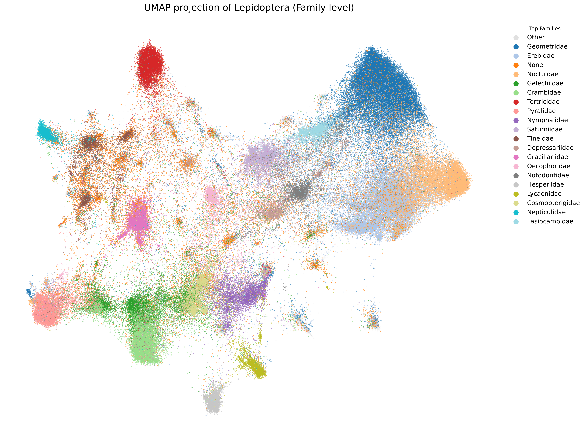

# Analysis of Embeddings: Folmer vs Leray and the Role of LDA

This document provides a clear analysis of the performance of embeddings derived from two different CO1 barcode regions—**Folmer** and **Leray**—and explains the rationale behind applying **Linear Discriminant Analysis (LDA)** to improve class separability.

## 1. Context: The CO1 Barcode Regions

The Cytochrome c oxidase subunit I (CO1) gene is the standard marker for DNA barcoding in animals. However, the exact fragment of this gene targeted for sequencing can vary:

- **Folmer Region**: This is the traditional DNA barcode region at the 5' end of the CO1 gene. For our analysis, we cropped the Folmer sequences to a standardized length between **500 and 660 base pairs** to ensure consistent embedding quality without losing vital phylogenetic signal. It is widely standardized and forms the backbone of reference databases like BOLD.
- **Leray Region**: A shorter, more specific sub-fragment (often ~313 base pairs) within the Folmer region. It was designed primarily for metabarcoding applications, where degraded DNA or environmental samples require shorter target sequences.

### Why Choose Folmer over Leray?
While the Leray fragment is highly useful in metabarcoding contexts due to its short length, the **Folmer region** provides significantly more phylogenetic signal due to its longer sequence length. For base models like Omni-DNA and DNABERT-S, which rely on contextual relationships across the entire sequence length, the richer information content of the full Folmer fragment generally yields more distinct, robust embeddings that better capture evolutionary divergence and taxonomic separation.

## 2. Unsupervised vs. Supervised Dimensionality Reduction

Raw embeddings produced by models like Omni-DNA or DNABERT-S are high-dimensional. To visualize taxonomic clusters or use them for simpler downstream tasks, we must reduce their dimensionality. 

### Unsupervised: UMAP (No LDA)

When we apply UMAP directly to the raw embeddings of the Folmer region, the algorithm attempts to preserve the local manifold structure of the data without knowing any taxonomic labels. While distinct clusters form, intra-class variance and inter-class similarities can cause taxonomic groups to blur together. 

### Supervised: Linear Discriminant Analysis (LDA)
**LDA** is a supervised dimensionality reduction technique that actively attempts to maximize the distance between different classes (e.g., Families or Genera) while minimizing the variance within each class. 

By applying LDA prior to (or instead of) UMAP, we explicitly teach the transformation to focus on the features of the embeddings that separate taxa. This results in significantly tighter clustering and better-defined boundaries between taxonomic groups, demonstrating that the underlying embeddings *do* contain the necessary phylogenetic signal—it just needs to be linearly separated based on taxonomic labels.

## 3. Comparing Folmer and Leray Post-LDA Across Models

When we compare the optimal transformations (LDA) of both regions, the differences in information content become apparent, not just for Omni-DNA, but also for DNABERT-S:

### Omni-DNA on Leray

### Omni-DNA on Leray (LDA)

### DNABERT-S on Leray

### DNABERT-S on Leray (LDA)

### The Verdict: Folmer + LDA
1. **Folmer Yields Better Separation**: The UMAP visualization of the Folmer region post-LDA shows cleaner, more distinct taxonomic clusters compared to the Leray region across foundation models. The Leray region, being less than half the length, lacks the requisite variance to cleanly resolve closer taxonomic relationships. The decision to crop the Folmer region to 500-660 base pairs ensures optimal signal-to-noise ratio.
2. **LDA Extracts the True Signal**: While raw embeddings can look unstructured (as seen in the base DNABERT-S Leray plot), LDA proves that models like Omni-DNA and DNABERT-S are successfully encoding taxonomic differences. LDA acts as a simple probing mechanism that pulls out this biological truth, yielding tightly packed taxonomic clusters in the final UMAP visualization.

**Conclusion:** We choose the **Folmer region (cropped 500-660bp)** because its length provides a richer contextual embedding for foundational models, and we employ **LDA** to explicitly surface and maximize the taxonomic separability inherent in those embeddings.
