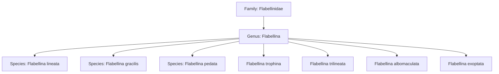
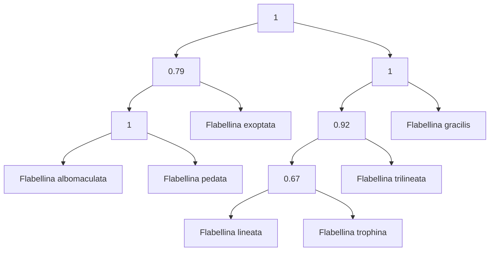
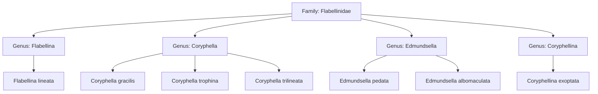

# Taxonomy and phylogenetics of nudibranchs. 

Several beautifull seaslugs (from the Flabellina family)

|  |  |  |  |  |  |  |
|:---:|:---:|:---:|:---:|:---:|:---:|:---:|
| Flabellina gracilis | Flabellina lineata | Flabellina pedata | Flabellina trophina | Flabbelina trilineata | Flabbelina albomaculata | Flabbelina exoptata |

In the the taxonomic tree (note: outdated since 2017) they were positioned like this based on morphology

__[source, January 2018](https://www.sciencedirect.com/science/article/abs/pii/S1055790317302191?via%3Dihub)__

However when they created a phylogenetic tree based on the moleculair DNA divergence it looked like this:

__[source, January 2018](https://www.sciencedirect.com/science/article/abs/pii/S1055790317302191?via%3Dihub)__

We can read that some species within this genus where more closely related than others. Note, from the taxonomic tree this is somehting you cannot read. So the writers of this article (and a few authors of more articles later) moved the species into new genera which became this taxonomic tree. Note: the second part (epithet) of the species name has not changed.

__[source](https://www.marinespecies.org/aphia.php?p=taxdetails&id=138019)__

