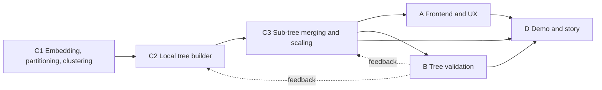

This file is the working reference for each team. It states what a team receives, what it must produce, and which neighbouring team owns the other side of each contract. Confirm every input and output format with the named upstream and downstream teams before building against it.

## Data flow at a glance

## Stream A: Frontend and user experience

How do users explore large phylogenetic trees?

* Upstream: Stream C3 (final scaled tree). Mock data unblocks work before C3 is ready.
* Downstream: Stream D (visual assets and story).
* Works in: `src/evospaice/viz/`.

Inputs:

* A Newick tree. No mock tree exists yet, so the first task is to generate one. Regenerate a real clade from the BOLD dump with `bcdm2tree.py`, or use `tsv2newick` in [ingest](../../src/evospaice/ingest/), following the Newick contract and annotation schema in [data/README.md](../../data/README.md). Keep the clade small: a genus or family renders, the full 1.1M-tip scaffold will not.
* Once available, the final tree from C3 in the same Newick format.

Outputs:

* Interactive tree visualization (mock data first, real tree later)
* User journey and storyboard
* Assets for the final video

Tasks:

* Generate mock Newick data for a non-trivial clade to develop against.
* Evaluate visualization packages specifically on how they handle load: how many tips they render before they stall, and how they degrade. Existing starting points in the repo are the static Biopython renderer and the UMAP plot on the feature branches (`src/evospaice/viz/biopython.py`, `src/evospaice/viz/plot_umap.py`); see [viz/README.md](../../src/evospaice/viz/README.md) for the intent to reuse tools such as iTOL rather than build a viewer.
* Confirm the Newick and annotation format with C3 so the viewer consumes the real output unchanged.

## Stream B: Tree validation

How do we know the tree we built is a good tree?

* Upstream: Stream C3 (tree to evaluate). Reference tree from Rutger's previous project is an external prerequisite.
* Downstream: Streams C2 and C3 (validation feedback), Stream D (validation story).
* Works in: `src/evospaice/validate/`.

Inputs:

* Reference tree from Rutger's previous project. Understand what it is and is not first: the BOLD BIN scaffold in [data/README.md](../../data/README.md) is a taxonomy-derived topology without branch lengths, not a phylogeny, so it cannot serve as the metric oracle by itself. Confirm which artifact is the trusted reference.
* The output tree from C3, plus the embedding distances behind it. The Parquet and FAISS embedding contract is in [data-contracts.md](../data-contracts.md) and [parquet-metadata-format.md](../parquet-metadata-format.md).

Outputs:

* Test datasets
* Validation metrics
* Evaluation code

Tasks:

* Understand and register the reference tree as the comparison baseline.
* Validate the output tree contract with Stream C3: agree the exact Newick, branch-length, and diagnostics format so evaluation code runs against C3 output without adaptation.
* Shortlist metrics. Start from the three properties in the "Validate the distance" section of the [Hackathon brief](hackathon-brief.md): depth-faithfulness, additivity, and tip-compression, measured against the k-mer baseline. Branch-length divergence is illustrated in [evolutionary-divergence.md](../explainers/evolutionary-divergence.md); pipeline validation precedent is in [validation-report.md](../validation-report.md).

## Stream C: Backend and tree construction

### Team C1: Embedding, partitioning, and clustering

Can we split sequences into independently solvable subsets?

* Upstream: pre-generated embeddings (external prerequisite).
* Downstream: Stream C2 (cluster subsets to build trees from).
* Works in: `src/evospaice/embeddings/` for encoding (on the `embeddings_yml` branch); put partitioning and clustering in a new `src/evospaice/cluster/` module.

Inputs:

* Embeddings for the target sequences. Use the embeddings generated from Logambal's work as the prerequisite, published as the Parquet and FAISS bundle described in [parquet-metadata-format.md](../parquet-metadata-format.md) (256-dimensional, L2-normalized Omni-DNA vectors, joined to taxonomy by `faiss_id`). It helps to have these embeddings in place before the hack.

Outputs:

* Sequence clusters, each an independently solvable subset, with a manifest that maps every record to its cluster.

Tasks:

* Run EDA on the embeddings and on species-level clustering: inspect separability, cluster sizes, and how well embedding neighbourhoods track taxonomy.
* Confirm the cluster handoff format with Stream C2: how a cluster's records, embeddings, and taxonomy are passed. The tree builder's current input contract is `TreeRecord` plus an embeddings array in `src/evospaice/tree/inputs.py`, which expects records and an `.npy` or `.tsv` embedding matrix. If the embeddings arrive as Parquet and FAISS, an adapter to that contract is part of this handoff.
* Identify a subset for the first end-to-end tree build (one family, genus, or even species). Candidate sources are Colin's outputs, or regenerate one with `filter_bcdm_bin_representatives.py` in [ingest](../../src/evospaice/ingest/), which picks one representative per BIN for a chosen taxon.

### Team C2: Local tree builder

Construct trees for individual clusters: distance matrix calculation, tree construction, and potentially parallelization.

* Upstream: Stream C1 (cluster subsets).
* Downstream: Stream C3 (local trees to merge).
* Works in: `src/evospaice/tree/` (on the `lidia/phylogentic_tree` branch): `distance.py`, `topology.py`, `lengths.py`, `representatives.py`, `pipeline.py`.

Inputs:

* One cluster at a time from C1: records, embeddings, and taxonomy, in the agreed handoff format.
* A starting scope for the first build (one family, genus, or species), coordinated with C1.

Outputs:

* A local tree per cluster with branch ordering and branch-length estimation, plus a representative vector to carry up.

Tasks:

* Build the local tree: distance matrix, topology, and branch lengths. A working implementation already exists on the `lidia/phylogentic_tree` branch (`tree/distance.py`, `tree/topology.py`, `tree/lengths.py`, `tree/representatives.py`, `tree/pipeline.py`) with tests; adopt or extend it rather than starting over.
* Confirm the input handoff with C1 and the sub-tree handoff with C3.
* Consider parallelization across clusters once one cluster builds correctly.

### Team C3: Sub-tree merging and scaling

Merge local trees into larger structures.

* Upstream: Stream C2 (local trees and representatives).
* Downstream: Streams A and B (final tree), Stream D.
* Works in: `src/evospaice/tree/` (on the `lidia/phylogentic_tree` branch): `full_scale_prepare.py`, `full_scale_worker.py`, `full_scale_finalize.py`, `cloud.py`.

> [!WARNING]
> Highest-risk technical area.

Inputs:

* Local trees and their carried-up representative vectors from C2.
* The taxonomy backbone that the local trees attach to.

Outputs:

* One merged, scaled tree in Newick, with branch lengths and diagnostics. This is the artifact Streams A and B consume.

Tasks:

* Define the sub-tree handoff convention with Stream C2: how a local tree, its root representative, and its attachment point are passed. Partial scaffolding exists on the `lidia/phylogentic_tree` branch (`tree/full_scale_prepare.py`, `tree/full_scale_worker.py`, `tree/full_scale_finalize.py`, `tree/cloud.py`).
* Test several approaches to reconcile local trees into the backbone and compare them, since this is the highest-risk step.
* Agree the final Newick and diagnostics format with Streams A and B so their work consumes C3 output unchanged.

## Stream D: Demo and story

* Upstream: Streams A, B, and C3 (visuals, validation results, final tree).
* Downstream: the final presentation.
* Works in: no dedicated module; presentation assets live in `images/` and `docs/`.

Inputs:

* Visual assets from Stream A, validation results from Stream B, and the final tree from C3.

Outputs:

* The demo narrative and final video.
