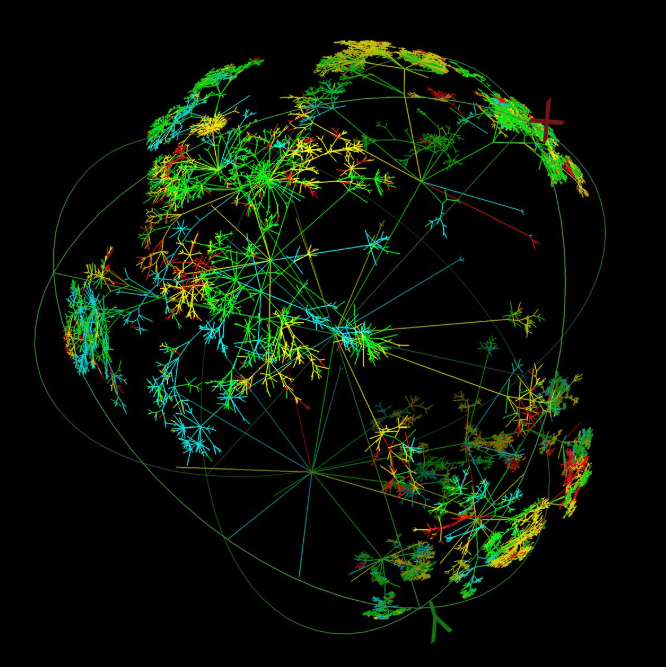
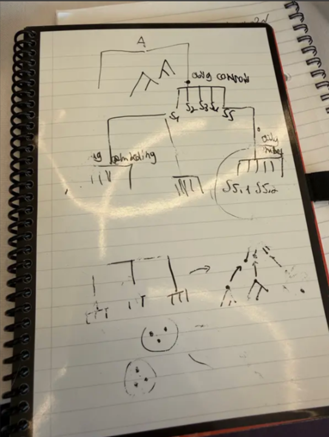
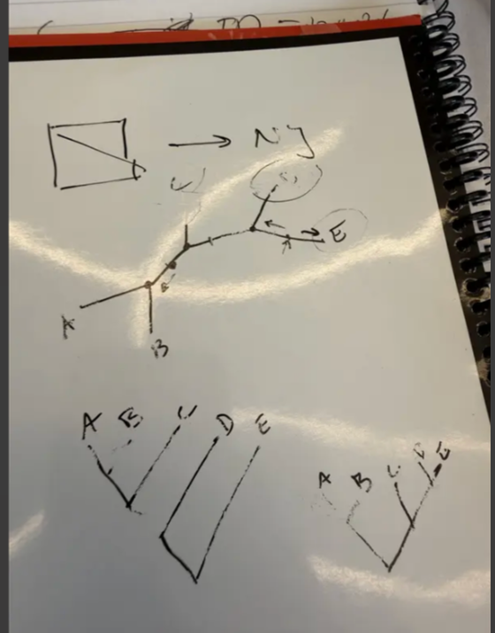
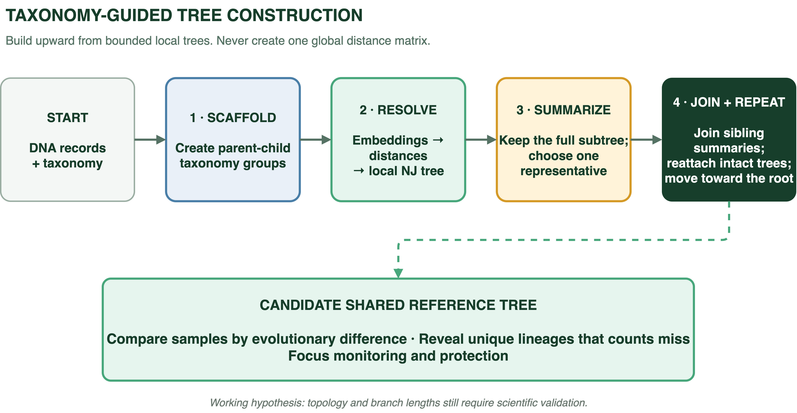
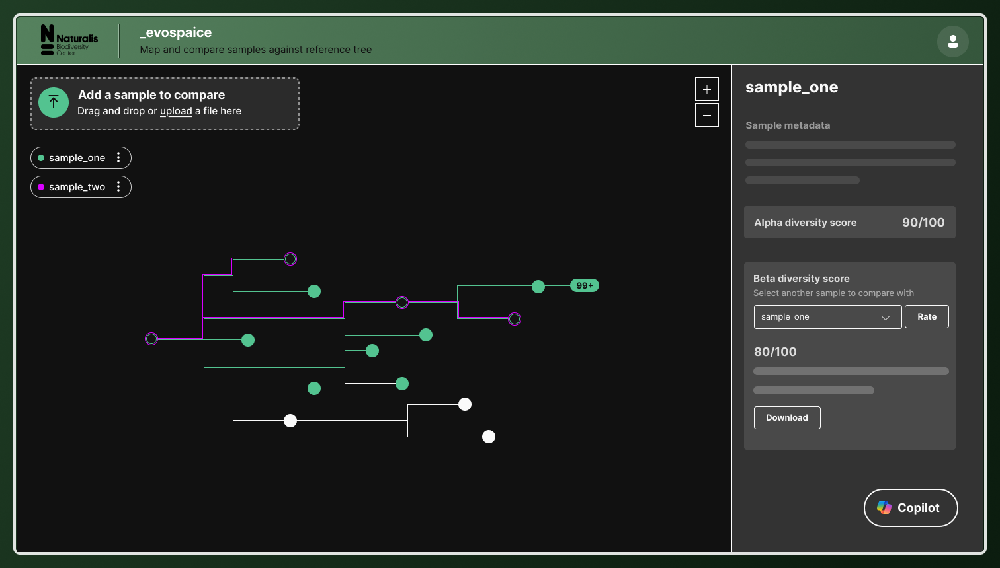

## 1. The decision blind spot

Visual: place two simplified trees side by side, each with ten highlighted
species. Use short branches and one dense cluster on the left; use long,
widely separated branches on the right. Put the same species-count badge above
both.

Species counts can hide what is hardest to replace. Imagine two ecosystems with
ten species each.

In one, the species are close relatives. In the other, they come from distant
branches of the tree of life. A species count gives both ecosystems the same
score, although the second contains much more evolutionary history.

> **Two sites can contain the same number of species while representing very
> different amounts of evolutionary history.**

This matters when comparing places, tracking ecological change, or deciding
what to protect. Losing one species among many close relatives is not equivalent
to losing the only representative of a unique lineage.

## 2. The missing capability and hypothesis

Visual: show a three-part proof frame around the hypothesis: scientific fidelity,
scale, and user value. Leave each part as an open question until its evidence
appears later in the readout.

Environmental DNA can already identify species from water, soil, and insect
samples. It cannot yet compare the evolutionary value those species represent
at the same scale. The missing capability is a reference tree whose branch
lengths show meaningful genetic distance.

Our [project hypothesis](../planning/hypothesis.md) is direct:

> A scalable DNA reference tree that captures evolutionary relationships can
> improve biodiversity measurement and support better-informed decisions.

For the hypothesis to hold, three things must be true:

* Scientific fidelity: do the distances represent genetic relationships?
* Scale: can the approach handle millions of reference records?
* User value: does it reveal something useful that species counts do not?

## 3. Why no suitable reference tree exists at this scale

Visual: use the existing fisheye tree as the background. Overlay the progression
`7 million sequences` to `24 trillion pairs` to make the scale wall immediate.

Public databases contain millions of DNA barcodes and taxonomic labels, but no
equivalent tree with calibrated branch lengths.

Traditional methods estimate distance by aligning DNA sequences. Each comparison
is expensive, and all-pairs comparison grows quadratically. Nearly seven million
sequences produce about 24 trillion possible pairs.

The barrier is not missing data. It is turning rapidly growing data into a
meaningful tree without comparing everything with everything.

## 4. The EvoSpaice proposition

EvoSpaice follows the taxonomy-guided construction schema developed by Ron. It
changes the shape of the problem:

> **Taxonomy provides the map. DNA embeddings provide the distance signal.
> Local computation makes it scale.**

The approach began as a workshop sketch: preserve the known taxonomic groups,
resolve each local subtree, choose a representative, and combine those results
into the next level of the tree.

A second sketch explored how local trees could be joined and compared without
building one global distance matrix.

The schema makes the hybrid construction route explicit:

1. Create parent-child groups from the taxonomy scaffold.
2. Use embedding distances and Neighbor Joining to resolve each local tree.
3. Keep each subtree intact and choose one representative for it.
4. Join sibling representatives, reattach their trees, and repeat toward the
  root.

The embedding-only route remains a comparator for testing whether taxonomy
improves the generated topology. Both routes turn millions of records into
bounded pieces of work that can be generated and evaluated repeatedly.

[Explore the interactive tree-construction flow](../architecture/tree-team-flow.html)

This avoids a global distance matrix. Biological knowledge constrains each local
problem, machine learning accelerates distance calculation, and recursive
processing keeps each step manageable.

For end users, the candidate shared tree creates one evolutionary scale for
comparing sites or timepoints. It can reveal unique lineages that species counts
miss and help focus monitoring or protection where loss would be hardest to
replace. This value depends on scientific validation of the final topology and
branch lengths.

## 5. What the team proved

Visual: lead with `6,979,067 records embedded` as the dominant number. Place
runtime and bundle count beneath it, then use a clear zero-failures marker as
the closing proof point.

| Proven result | Outcome |
| --- | --- |
| Insect DNA records embedded | 6,979,067 |
| Embedding runtime | About 20 minutes |
| Species bundles created | 131,914 |
| Species-splitting runtime | About three minutes across eight CPU jobs |
| Failed shards and dead letters | 0 |

All record IDs reconciled, and output manifests and checksums matched. The
[validation report](../operations/validation-report.md) and
[performance evidence](../architecture/performance-and-cost.md) document these
results.

**Conclusion:** processing and organizing the reference data at this scale is
feasible.

## 6. The value

A validated tree would let people compare biodiversity by evolutionary history,
not only by species count.

Consider two sites that each lose five species. Counts report the same decline.
If one site loses close relatives while the other loses a unique lineage, the
second loss removes more evolutionary history. The tree makes that difference
visible, helping a conservation team prioritize investigation or restoration.

The UX concept shows how that infrastructure reaches an end user. A scientist
uploads samples, sees where each sample falls on the shared reference tree, and
compares alpha diversity within a sample and beta diversity between samples.
The result turns tree structure into a score, a visible comparison, and an
exportable result rather than leaving the user to interpret raw DNA records.

| User | What they can decide | Clear value |
| --- | --- | --- |
| Scientist | Which sample contains more evolutionary diversity? | Compare ecosystems accurately, even when species counts are equal |
| Ecologist | Has an ecosystem lost important diversity over time? | Detect loss that a stable species count would hide |
| Collection manager | Which DNA records need expert review? | Find likely errors before they distort research results |
| Conservation team | Which site protects the most irreplaceable lineages? | Direct limited funding toward biodiversity that is hardest to replace |
| Policymaker | Which areas or trends need action first? | Prioritize policy using biological significance, not counts alone |

The promise is straightforward: better information for deciding what changed,
what is distinctive, and what may be hardest to replace.

## 7. An evaluation loop for improving the tree

Visual: show a circular four-step loop: `generate`, `compare`, `inspect`, and
`improve`. Place normalized Robinson-Foulds scores in the center, with
several experiment variants feeding into the same reference tree.

EvoSpaice includes evaluation capabilities, not only a generation pipeline.
Each tree-generation experiment can be compared with a reference tree using normalized Robinson-Foulds and a ranking metric of tip to root distances. The evaluator aligns shared leaves,
supports rooted and unrooted comparisons, and records which relationships are
shared, missing, or newly inferred. The
[tree-evaluation guide](../../src/evospaice/validate/README_metrics.md) documents
the workflow and metrics.

This creates a practical improvement loop:

1. Generate a tree with a new model, distance method, or parameter set.
2. Evaluate its topology against the same reference and benchmark taxa.
3. Compare the results with previous experiments.
4. Keep the changes that improve tree quality.

The current evaluator measures topology and simple branch-length
validation. Further work can build on our foundation to further test whether distances preserve genetic relationships, remain
additive along tree paths, and outperform a k-mer baseline. Together, these
capabilities turn tree generation into a repeatable, evidence-led experiment
rather than a one-off result.

> **EvoSpaice moves biodiversity measurement from counting species to measuring
> the evolutionary history they represent.**

The scalable foundation now exists. The next milestone is to earn scientific
trust and prove the value in one concrete use case.

## Evidence

* [Project hypothesis](../planning/hypothesis.md)
* [Success criteria](../planning/success-criteria.md)
* [Pipeline architecture](../architecture/pipeline-architecture.md)
* [Production validation report](../operations/validation-report.md)
