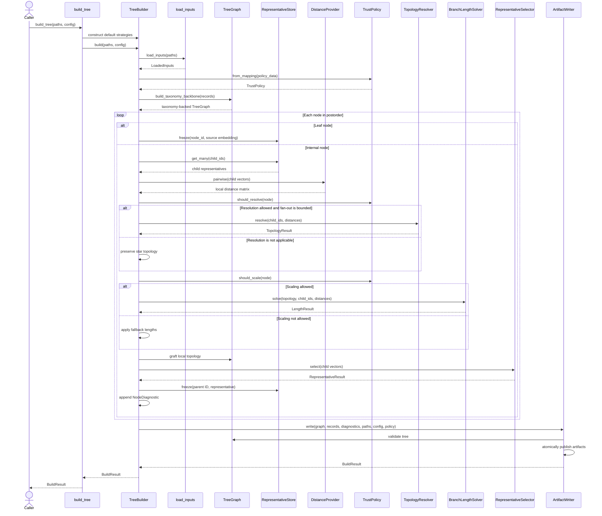

# Tree classes and responsibilities

The `evospaice.tree` package builds a rooted, scaled tree from validated
taxonomy records and precomputed embedding vectors. It keeps the permanent
taxonomy-backed graph separate from the temporary local topologies used to
resolve one internal node at a time.

The build follows this path:

1. Load and validate records, embeddings, their index, and the trust policy.
2. Build the taxonomy backbone.
3. Walk the backbone in postorder, from leaves toward the root.
4. At each internal node, calculate local child distances, choose a topology,
   fit branch lengths, and select one representative vector for the parent.
5. Validate the completed tree and publish its artifacts.

## Class diagram

The solid diamonds identify owned data, dashed arrows identify use, and dashed
inheritance arrows show protocol implementations.

```mermaid
classDiagram
    class TreeRecord {
        <<frozen dataclass>>
        leaf_id
        record_id
        bin_uri
        taxonomy
        embedding_row
    }
    class TreeNode {
        <<dataclass>>
        node_id
        label
        rank
        parent_id
        child_ids
        branch_length
        is_leaf
    }
    class TreeBuildConfig {
        <<frozen dataclass>>
        metric
        representative
        max_nj_children
        centroid_drift_limit
        fallback_branch_length
    }
    class InputPaths {
        <<frozen dataclass>>
        records
        embeddings
        embedding_index
        trust_policy
        output_dir
    }
    class NodeDiagnostic {
        <<frozen dataclass>>
        topology_method
        length_method
        representative_method
        fit_error
    }
    class BuildResult {
        <<frozen dataclass>>
        tree_path
        diagnostics_path
        manifest_path
        leaf_count
        node_count
    }
    class InputValidationError {
        <<exception>>
    }
    class LoadedInputs {
        <<frozen dataclass>>
        records
        embeddings
        policy_data
        vector_for(record)
    }
    class TreeGraph {
        root_id
        nodes
        add(node)
        postorder()
    }
    class LocalNode {
        <<dataclass>>
        source_id
        children
        length
        leaf_ids()
    }
    class TopologyResult {
        <<frozen dataclass>>
        root
        method
    }
    class TopologyResolver {
        <<protocol>>
        resolve(child_ids, distances)
    }
    class NeighborJoiningResolver {
        resolve(child_ids, distances)
    }
    class DistanceProvider {
        <<protocol>>
        pairwise(vectors)
    }
    class CosineDistanceProvider {
        name
        pairwise(vectors)
    }
    class LengthResult {
        <<frozen dataclass>>
        topology
        method
        fit_error
        clamped_lengths
    }
    class BranchLengthSolver {
        <<protocol>>
        solve(topology, child_ids, distances)
    }
    class NonNegativeLeastSquaresSolver {
        solve(topology, child_ids, distances)
    }
    class RepresentativeResult {
        <<frozen dataclass>>
        vector
        method
        centroid_drift
    }
    class RepresentativeSelector {
        <<protocol>>
        select(vectors)
    }
    class CentroidMedoidSelector {
        select(vectors)
    }
    class RepresentativeStore {
        freeze(node_id, vector)
        get_many(node_ids)
    }
    class TrustPolicy {
        <<frozen dataclass>>
        version
        resolve_ranks
        scale_ranks
        should_resolve(node)
        should_scale(node)
    }
    class TreeBuilder {
        build(paths, config)
        choose_topology()
        graft()
    }
    class ArtifactWriter {
        write(graph, records, diagnostics, paths, config, policy)
    }
    class ObjectStore {
        <<protocol>>
        download(object_name, destination)
        upload(source, object_name)
    }
    class BlobObjectStore {
        download(object_name, destination)
        upload(source, object_name)
    }
    class CloudRunConfig {
        <<frozen dataclass>>
        input_prefix
        output_prefix
        embeddings_name
    }

    LoadedInputs *-- TreeRecord
    TreeGraph *-- TreeNode
    TopologyResult *-- LocalNode
    LengthResult --> TopologyResult
    DistanceProvider <|.. CosineDistanceProvider
    TopologyResolver <|.. NeighborJoiningResolver
    BranchLengthSolver <|.. NonNegativeLeastSquaresSolver
    RepresentativeSelector <|.. CentroidMedoidSelector
    ObjectStore <|.. BlobObjectStore
    TreeBuilder o-- DistanceProvider
    TreeBuilder o-- TopologyResolver
    TreeBuilder o-- BranchLengthSolver
    TreeBuilder o-- RepresentativeSelector
    TreeBuilder o-- ArtifactWriter
    TreeBuilder ..> RepresentativeStore
    TreeBuilder ..> LoadedInputs
    TreeBuilder ..> TreeGraph
    TreeBuilder ..> TrustPolicy
    TreeBuilder ..> NodeDiagnostic
    TreeBuilder ..> BuildResult
    ArtifactWriter ..> InputPaths
    ArtifactWriter ..> TreeBuildConfig
```

## Domain models

### `TreeRecord`

`TreeRecord` is the immutable input representation of one selected tree tip.
It connects a stable `leaf_id` and source `record_id` to a BIN URI, a complete
taxonomy path, and the row containing its embedding. It provides provenance;
it does not participate in graph mutation.

### `TreeNode`

`TreeNode` is a mutable node in the final tree. It stores identity, display
label, taxonomic rank, parent and child IDs, branch length, and optional leaf
provenance. Its `is_leaf` property is true when `leaf_id` is present. Embedding
vectors deliberately live outside this object to keep the graph compact.

### `TreeBuildConfig`

`TreeBuildConfig` contains algorithm settings that must be recorded for a
reproducible build. It validates the Neighbor-Joining fan-out limit, centroid
drift limit, and fallback branch length when it is constructed.

### `InputPaths`

`InputPaths` names all files involved in one local build: records, embeddings,
the optional embedding index and trust policy, and the output directory.

### `NodeDiagnostic`

`NodeDiagnostic` is the audit record for one processed internal node. It
captures which topology, length, and representative methods were used, the
fit error, matrix size, and any reason that normal resolution was skipped.

### `BuildResult`

`BuildResult` is the public result of a successful build. It returns the paths
of the main artifacts together with leaf and node counts.

## Inputs and validation

### `InputValidationError`

`InputValidationError` identifies violations of the tree input contract, such
as duplicate IDs, invalid embedding indexes, empty vectors, or malformed
policy data.

### `LoadedInputs`

`LoadedInputs` holds the fully validated records, embedding matrix, and raw
trust-policy mapping. `vector_for()` retrieves a record's vector through its
validated embedding row. The `load_inputs()` adapter is responsible for
constructing this object.

## Permanent graph

### `TreeGraph`

`TreeGraph` owns the permanent tree and its mutations. It stores nodes by ID,
rejects duplicate IDs, updates a parent's children when a node is added, and
provides iterative postorder traversal. `build_taxonomy_backbone()` constructs
the initial graph from each record's full taxonomy path and attaches one leaf
per record.

## Temporary local topology

### `LocalNode`

`LocalNode` represents one node in the temporary topology built for the direct
children of a single taxonomy node. A non-null `source_id` points to an
existing `TreeNode`; a node without one is synthetic. Its `length` is the
incoming local edge length, and `leaf_ids()` identifies all original children
below it.

### `TopologyResult`

`TopologyResult` packages a local root and the name of the method that produced
it. The method distinguishes Neighbor Joining from a preserved star topology.

### `TopologyResolver`

`TopologyResolver` is the protocol for replaceable local-topology algorithms.
An implementation receives existing child IDs and their pairwise distance
matrix and returns a `TopologyResult`.

### `NeighborJoiningResolver`

`NeighborJoiningResolver` is the default deterministic topology strategy. It
repeatedly chooses the pair with the minimum Neighbor-Joining score, merges
that pair, updates the remaining distances, and returns a binary local tree.
Deterministic ID ordering resolves equal-score ties.

The `star_topology()` function supplies the non-resolved alternative. It keeps
all existing children directly beneath one local root.

## Scientific strategies

### `DistanceProvider`

`DistanceProvider` defines the pairwise-distance interface. Its deliberately
local API accepts only the vectors supplied for the current node, which makes
accidental construction of a global distance matrix harder.

### `CosineDistanceProvider`

`CosineDistanceProvider` is the default distance implementation. It validates
finite, non-zero vectors, normalizes them, computes cosine distance, restores
exact symmetry, clips values to the valid range $[0, 2]$, and clears the
diagonal.

### `LengthResult`

`LengthResult` returns a topology whose edges have been assigned lengths. It
also reports the fitting method, root-mean-square fit error, and number of
clamped lengths.

### `BranchLengthSolver`

`BranchLengthSolver` defines the replaceable branch-length fitting interface.
It receives a fixed local topology and the observed child distance matrix.

### `NonNegativeLeastSquaresSolver`

`NonNegativeLeastSquaresSolver` fits non-negative edge lengths so path lengths
through the local topology approximate observed embedding distances. It uses
SciPy's NNLS solver for three or more children, splits a two-child distance
equally, and uses the configured fallback for a single child.

When policy disallows scaling, `apply_fallback_lengths()` assigns the
configured constant to every local edge instead of invoking the solver.

### `RepresentativeResult`

`RepresentativeResult` contains the vector carried from a completed node to
its parent, the selection method, and its measured centroid drift.

### `RepresentativeSelector`

`RepresentativeSelector` defines the strategy for reducing several direct
child vectors to one parent representative.

### `CentroidMedoidSelector`

`CentroidMedoidSelector` first calculates a normalized, equal-child centroid.
If the closest real child is farther from that centroid than the configured
limit, it uses that child as a medoid instead. This prevents an implausible
synthetic vector from propagating upward.

### `RepresentativeStore`

`RepresentativeStore` is a write-once vector map used during one build. Leaves
receive their source embedding and internal nodes receive their selected
representative. Rejecting a second write prevents completed child
representatives from drifting later in the traversal.

### `TrustPolicy`

`TrustPolicy` turns the policy mapping into immutable rank sets. It answers two
independent questions for each node: whether its child topology may be
resolved and whether its branch lengths may be scaled. The wildcard `*`
allows all ranks.

## Orchestration and publication

### `TreeBuilder`

`TreeBuilder` is the application service coordinating the build. It owns no
scientific algorithm; each strategy is injected through a protocol. During a
postorder walk it freezes leaf embeddings, processes each internal node,
grafts local synthetic nodes into the permanent graph, records diagnostics,
and delegates publication to `ArtifactWriter`.

Topology selection has three outcomes:

- fewer than three children preserve the existing star;
- policy or the configured fan-out limit can preserve the star; or
- `TopologyResolver` resolves the local topology.

The `build_tree()` convenience function constructs `TreeBuilder` with the
default cosine, Neighbor-Joining, NNLS, and centroid-medoid strategies.

### `ArtifactWriter`

`ArtifactWriter` validates graph connectivity, branch lengths, uniqueness, and
leaf coverage before publishing anything. It atomically writes the Newick
tree, node diagnostics, exclusions file, completion checkpoint, and manifest.
The manifest records configuration, policy, counts, local-distance limits, and
input/output SHA-256 hashes.

## Cloud execution

### `ObjectStore`

`ObjectStore` is the storage protocol used by the cloud runner. It isolates
the pipeline from a specific object-storage SDK through `download()` and
`upload()` operations.

### `BlobObjectStore`

`BlobObjectStore` implements `ObjectStore` for Azure Blob Storage using managed
identity. It records a SHA-256 digest as blob metadata, skips an already
identical artifact, and refuses to overwrite an object with different
content.

### `CloudRunConfig`

`CloudRunConfig` contains the input prefix, output prefix, and embeddings
filename for one cloud run. `run_cloud_tree()` uses it to stage immutable
inputs in a temporary directory, invoke `build_tree()`, and upload outputs in
publication order.

## Build interaction diagram

This sequence shows the main local build. The internal-node block repeats from
the deepest taxonomy node through the root.

