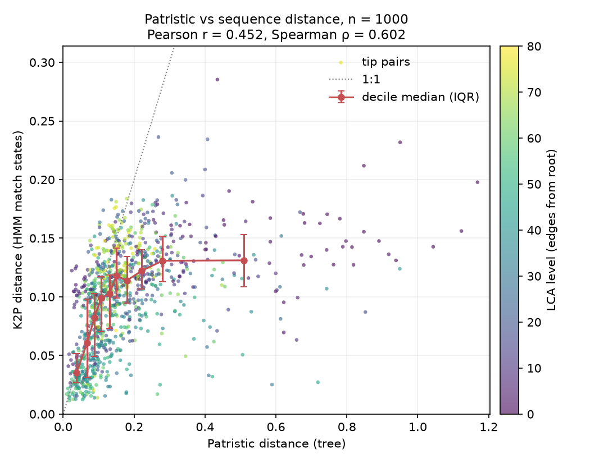

# Stratified embedding vs sequence distance validation results

This folder contains results of an experiment to assess how distances in embedding
space behave compared to distances in pairwise sequence distance space. Note that these
results are ephemeral: they depend on specific inputs (trees, BOLD releases) as well as
specific parameters, including a random number seed that was set to 42. More about the
validation procedure is explained [one level up](../)

The following files are in here:

- [pairs_strat.fasta](pairs_strat.fasta) - this is an unaligned FASTA file of the BOLD
  sequences that were sampled in the analysis
- [pairs_strat.a2m](pairs_strat.a2m) - this is an aligned FASTA file for the same 
  sequences. The alignment was done using a Hidden Markov Model for the COI-5P marker
  as used by the program `hmmer`.
- [pairs_strat.png](pairs_strat.png) - a plot that shows how distances in embedding space
  behave compared to (K2P-corrected) sequence distance space
- [pairs_strat.tsv](pairs_strat.tsv) - table with embedding distances (patristic distance)
  versus sequence distances, analytics about the alignment (# of aligned sites) and
  stratification level
