## Tree diagrams

Green marks shared splits, blue inferred-only splits, and orange reference-only splits.
These are unrooted trees displayed from their Newick junctions, not biological roots.
Branch lengths are labelled; the layout is not to scale.

```mermaid
%% Unrooted trees displayed from their Newick junctions, not biological roots.
%% Edge labels reproduce the Newick branch lengths; layout is not to scale.
%% Internal node labels show one side of each incoming-edge split.
%% Green = shared split; blue = inferred-only; orange = reference-only.
%% Each tree has 14 tips. Shared = 8; inferred-only = 2; reference-only = 3.
flowchart LR
    subgraph inferred["Inferred: 10 informative splits"]
        direction TB
        inf_junction((Junction))
        inf_junction -->|0.10| inf_abcd["A B C D"]
        inf_abcd -->|0.05| inf_ab["A B"]
        inf_ab -->|0.02| inf_a["A"]
        inf_ab -->|0.03| inf_b["B"]
        inf_abcd -->|0.20| inf_cd["C D"]
        inf_cd -->|0.12| inf_c["C"]
        inf_cd -->|0.15| inf_d["D"]
        inf_junction -->|0.11| inf_efij["E F I J"]
        inf_efij -->|0.06| inf_ef["E F"]
        inf_ef -->|0.04| inf_e["E"]
        inf_ef -->|0.05| inf_f["F"]
        inf_efij -->|0.05| inf_ij["I J"]
        inf_ij -->|0.03| inf_i["I"]
        inf_ij -->|0.04| inf_j["J"]
        inf_junction -->|0.12| inf_ghkl["G H K L"]
        inf_ghkl -->|0.09| inf_gh["G H"]
        inf_gh -->|0.07| inf_g["G"]
        inf_gh -->|0.08| inf_h["H"]
        inf_ghkl -->|0.08| inf_kl["K L"]
        inf_kl -->|0.06| inf_k["K"]
        inf_kl -->|0.07| inf_l["L"]
        inf_junction -->|0.13| inf_mn["M N"]
        inf_mn -->|0.09| inf_m["M"]
        inf_mn -->|0.10| inf_n["N"]
    end

    subgraph reference["Reference: 11 informative splits"]
        direction TB
        ref_junction((Junction))
        ref_junction -->|0.10| ref_abcd["A B C D"]
        ref_abcd -->|0.05| ref_ab["A B"]
        ref_ab -->|0.02| ref_a["A"]
        ref_ab -->|0.03| ref_b["B"]
        ref_abcd -->|0.20| ref_cd["C D"]
        ref_cd -->|0.12| ref_c["C"]
        ref_cd -->|0.15| ref_d["D"]
        ref_junction -->|0.11| ref_efgh["E F G H"]
        ref_efgh -->|0.06| ref_ef["E F"]
        ref_ef -->|0.04| ref_e["E"]
        ref_ef -->|0.05| ref_f["F"]
        ref_efgh -->|0.09| ref_gh["G H"]
        ref_gh -->|0.07| ref_g["G"]
        ref_gh -->|0.08| ref_h["H"]
        ref_junction -->|0.14| ref_ijklmn["I J K L M N"]
        ref_ijklmn -->|0.12| ref_ijkl["I J K L"]
        ref_ijkl -->|0.05| ref_ij["I J"]
        ref_ij -->|0.03| ref_i["I"]
        ref_ij -->|0.04| ref_j["J"]
        ref_ijkl -->|0.08| ref_kl["K L"]
        ref_kl -->|0.06| ref_k["K"]
        ref_kl -->|0.07| ref_l["L"]
        ref_ijklmn -->|0.13| ref_mn["M N"]
        ref_mn -->|0.09| ref_m["M"]
        ref_mn -->|0.10| ref_n["N"]
    end

    inferred ~~~ reference

    classDef shared fill:#dcfce7,stroke:#15803d,color:#14532d
    classDef inferredOnly fill:#dbeafe,stroke:#2563eb,color:#1e3a8a
    classDef referenceOnly fill:#ffedd5,stroke:#c2410c,color:#7c2d12
    class inf_abcd,inf_ab,inf_cd,inf_ef,inf_gh,inf_ij,inf_kl,inf_mn shared
    class ref_abcd,ref_ab,ref_cd,ref_ef,ref_gh,ref_ij,ref_kl,ref_mn shared
    class inf_efij,inf_ghkl inferredOnly
    class ref_efgh,ref_ijkl,ref_ijklmn referenceOnly
```

